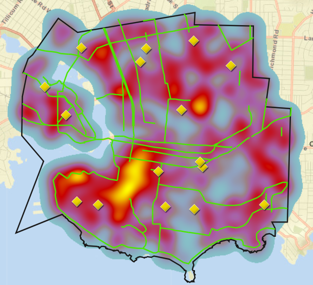

# ArcGIS Victoria Map
https://pd1996.github.io/ArcGIS-Victoria-Map/

A simple webpage containing an embedded ArcGIS map I made which displays voting locations within Victoria, BC. It also displays vehicle traffic density and available bike routes within the city. The aim of the map is to reduce vehicle traffic by showing people where they can bike to when it comes time to vote.

